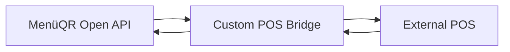

# Build a Custom POS Bridge

Use provider `custom` when building a connector for an unsupported POS or middleware platform.

## Minimal Architecture

## Required Jobs

1. Catalog sync job:
   - Pull `/menu`.
   - Upsert categories/products in the POS.
   - Store mappings in MenüQR.

2. Order job:
   - Poll `/orders?status=pending`.
   - Create POS tickets.
   - Acknowledge orders with external IDs.

3. Bill job:
   - Poll `/bills?status=open`.
   - Close or pay bills in the POS.
   - Call `/bills/{billId}/settle`.

4. Webhook receiver:
   - Forward POS lifecycle events to `/webhooks/{eventType}`.
   - Include event IDs for dedupe.

## Production Checklist

- Use a dedicated Open API key per restaurant and provider.
- Store API keys in a secret manager.
- Implement retries with exponential backoff.
- Make writes idempotent with mappings and external IDs.
- Log MenüQR `requestId` for failed responses.
- Keep local sync state, but trust MenüQR mappings as shared sync memory.
